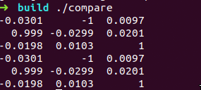
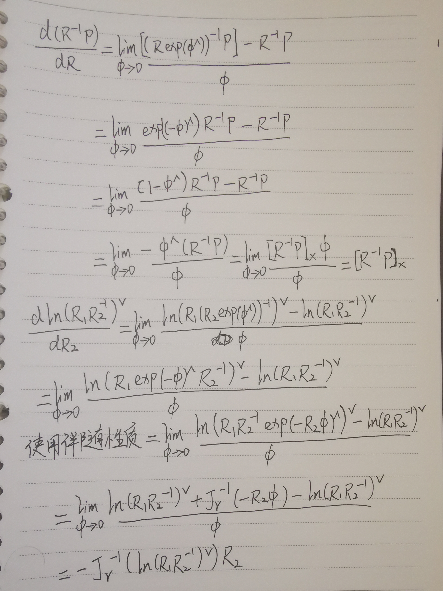

## VIO阅读文献

- IMU可以提供姿态随时间变化量，但存在累计误差。视觉可以提供平台移动的位置或方向，但可靠性取决于环境条件。融合后既可以使用IMU的连续变化，又可以在特殊点对IMU数据进行矫正，避免累计误差
- 激光雷达+IMU,GNSS+IMU,或IMU+激光雷达+GNSS
- vins-mono是近年来比较优秀的开源代码
- 对滑窗功能没有理解透彻，希望老师给以帮助

## 四元数和李代数更新

直接只用CMakeLists进行编译，主要代码如下

```C++
// 沿Z轴转90度的旋转矩阵
Eigen::Matrix3d R = Eigen::AngleAxisd(M_PI / 2, Eigen::Vector3d(0, 0, 1)).toRotationMatrix();
Eigen::Vector3d w(0.01, 0.02, 0.03);

Eigen::Matrix3d R_exp = R * Sophus::SO3d::exp(w).matrix();

Eigen::Quaterniond q(R);

Eigen::Quaterniond w_q(1, 0.5 * w(0), 0.5 * w(1), 0.5 * w(2));
w_q.normalize(); //归一化

Eigen::Quaterniond q_q = q * w_q;

Eigen::Matrix3d r_q_q = q_q.toRotationMatrix();

std::cout.precision(3);
std::cout << R_exp << std::endl;
std::cout << r_q_q << std::endl;
```

编译命令如下:

```bash
make build
cd build
cmake ..
make
./compare
```

运行结果如下



## 其他导数

