### 第三章

[TOC]


### 1样例代码

#### 1.1$\mu$ 曲线

保存currentLambda_数据写入文本，代码如下

```c++
bool Problem::Solve(int iterations) {
    ...
    char file_path[] = "/home/eric/vio_work/src/CurveFitting_LM/log/lambda.txt";
    std::remove(file_path);
    std::ofstream ofs;
    ofs.open(file_path, std::ios::out);

    if (!ofs) {
        std::cerr << "无法生成文件: " << file_path << std::endl
            << std::endl;
    }
    ...
    std::cout << "iter: " << iter << " , chi= " << currentChi_ << " , Lambda= " << currentLambda_
        << std::endl;
    ofs << currentLambda_ << ",";
    ...
	ofs.close();
    ...
```

保存的文件数据

```tex
19.95,2.21667,0.246296,0.0273663,0.0030407,0.000337855,3.75394e-05,4.17105e-06,
```

使用python画图，代码如下

```python
#!/usr/bin/python3
# -*- coding: UTF-8 -*-
import matplotlib.pyplot as plt
import numpy as np


#获取文本内容
f = open("../log/lambda.txt",encoding = "utf-8")
lambdas_txt = f.read()
f.close()
#分割字符串，删除''
lambdas = lambdas_txt.split(',')
while '' in lambdas:
    lambdas.remove('')
#字符串转float
lambdas = [float(x) for x in lambdas]
print(lambdas)

x = range(len(lambdas))

# 设置画布
plt.figure()


# 标题
plt.title("lambdas")
#数据
plt.plot(x,lambdas, '-p', color='grey',
        marker = 'o',
        markersize=8, linewidth=2,
        markerfacecolor='red',
        markeredgecolor='grey',
        markeredgewidth=2,label='lambdas')
# 坐标描述
plt.xlabel('index')
plt.ylabel('lambda')

# 设置数字标签
for a,b in zip(x,lambdas):
    plt.text(a,b,'%.2f'%b,ha='center', va='bottom', fontsize=10)


plt.legend()
plt.show()
```

效果如下

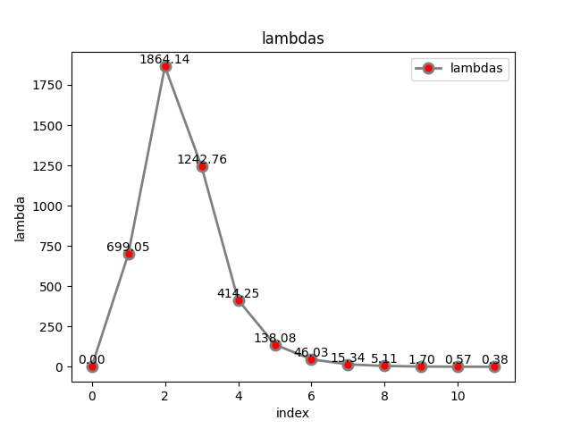

#### 1.2 函数修改为$y=ax^2+bx+c$

修改代码如下

```c++
// 构造 N 次观测
for (int i = 0; i < N; ++i) {
    double x = i / 100.;
    double n = noise(generator);
    // 观测 y
    // double y = std::exp(a * x * x + b * x + c) + n;
    //        double y = std::exp( a*x*x + b*x + c );
    double y = a * x * x + b * x + c + n;

    // 每个观测对应的残差函数
    shared_ptr<CurveFittingEdge> edge(new CurveFittingEdge(x, y));
    std::vector<std::shared_ptr<Vertex>> edge_vertex;
    edge_vertex.push_back(vertex);
    edge->SetVertex(edge_vertex);

    // 把这个残差添加到最小二乘问题
    problem.AddEdge(edge);
}

```

修改误差模型和雅克比计算

```c++
virtual void ComputeResidual() override {
    Vec3 abc = verticies_[0]->Parameters(); // 估计的参数
    // residual_(0) = std::exp(abc(0) * x_ * x_ + abc(1) * x_ + abc(2)) - y_; // 构建残差
    residual_(0) = abc(0) * x_ * x_ + abc(1) * x_ + abc(2) - y_;
}
// 计算残差对变量的雅克比
virtual void ComputeJacobians() override {
    // Vec3 abc = verticies_[0]->Parameters();
    // double exp_y = std::exp(abc(0) * x_ * x_ + abc(1) * x_ + abc(2));

    // Eigen::Matrix<double, 1, 3> jaco_abc; // 误差为1维，状态量 3 个，所以是 1x3 的雅克比矩阵
    // jaco_abc << x_ * x_ * exp_y, x_ * exp_y, 1 * exp_y;
    // jacobians_[0] = jaco_abc;
    Eigen::Matrix<double, 1, 3> jaco_abc;
    jaco_abc << x_ * x_, x_, 1;
    jacobians_[0] = jaco_abc;
}
```

N为100时计算不够准确，故将观测次数修改为500，1000，结果如下

|   N   |             效果             |
| :---: | :--------------------------: |
|  100  |  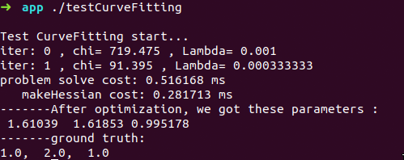  |
|  500  |  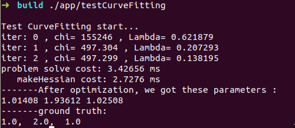  |
| 1000  | 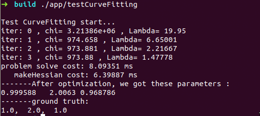 |

随着观测次数变大，参数拟合的精度越来越高，1000时误差为小数点后2位

#### 1.3 更优秀阻尼因子

参考论文The Levenberg-Marquardt method for nonlinear least squares curve-fitting problems

可以看到4.1.1节如下

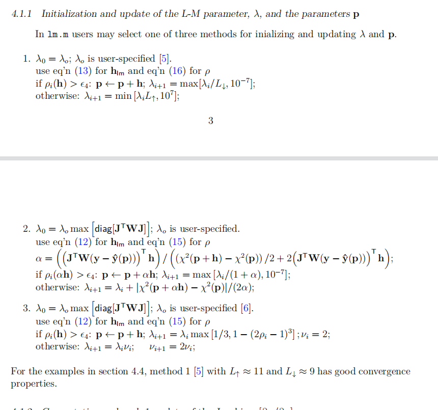

代码中通过3实现的，采用1来实现。$\lambda_0$的初值，为了方便对比，与1000次时设置一致

```c++
void Problem::ComputeLambdaInitLM() {
    ni_ = 2.;
    currentLambda_ = -1.;
    currentChi_ = 0.0;
    // TODO:: robust cost chi2
    for (auto edge : edges_) {
        currentChi_ += edge.second->Chi2();
    }
    if (err_prior_.rows() > 0)
        currentChi_ += err_prior_.norm();

    stopThresholdLM_ = 1e-6 * currentChi_; // 迭代条件为 误差下降 1e-6 倍

    // double maxDiagonal = 0;
    // ulong size = Hessian_.cols();
    // assert(Hessian_.rows() == Hessian_.cols() && "Hessian is not square");
    // for (ulong i = 0; i < size; ++i) {
    //     maxDiagonal = std::max(fabs(Hessian_(i, i)), maxDiagonal);
    // }
    // double tau = 1e-5;
    // currentLambda_ = tau * maxDiagonal;
    currentLambda_ = 19.95;
}
```

公式12和13主要区别对H修改方式

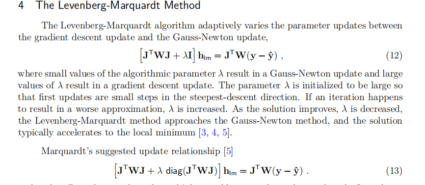

```c++
void Problem::AddLambdatoHessianLM() {
    ulong size = Hessian_.cols();
    assert(Hessian_.rows() == Hessian_.cols() && "Hessian is not square");
    for (ulong i = 0; i < size; ++i) {
        // Hessian_(i, i) += currentLambda_;
        Hessian_(i, i) += currentLambda_ * Hessian_(i, i);
    }
}
```

因上面的H矩阵的处理发生了变化，去除$\lambda$的影响也要修改

```c++
void Problem::RemoveLambdaHessianLM() {
    ulong size = Hessian_.cols();
    assert(Hessian_.rows() == Hessian_.cols() && "Hessian is not square");
    // TODO:: 这里不应该减去一个，数值的反复加减容易造成数值精度出问题？而应该保存叠加lambda前的值，在这里直接赋值
    for (ulong i = 0; i < size; ++i) {
        // Hessian_(i, i) -= currentLambda_;
        Hessian_(i, i) /= 1.0 + currentLambda_;
    }
}
```

公式15与16的区别主要在分母上

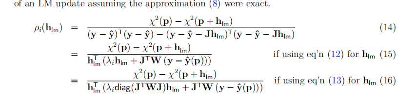

```c++
bool Problem::IsGoodStepInLM() {
    double scale = 0;

    // scale = delta_x_.transpose() * (currentLambda_ * delta_x_ + b_);
    // scale += 1e-3; // make sure it's non-zero :)

    // recompute residuals after update state
    // 统计所有的残差
    double tempChi = 0.0;
    for (auto edge : edges_) {
        edge.second->ComputeResidual();
        tempChi += edge.second->Chi2();
    }

    ulong size = Hessian_.cols();
    MatXX diag_H(MatXX::Zero(size, size));
    for (ulong i = 0; i < size; i++) {
        diag_H(i, i) = Hessian_(i, i);
    }

    scale = delta_x_.transpose() * (currentLambda_ * diag_H * delta_x_ + b_);
    scale += 1e-6; // make sure it's non-zero :)

    double rho = (currentChi_ - tempChi) / scale;
    // if (rho > 0 && isfinite(tempChi)) // last step was good, 误差在下降
    // {
    //     double alpha = 1. - pow((2 * rho - 1), 3);
    //     alpha = std::min(alpha, 2. / 3.);
    //     double scaleFactor = (std::max)(1. / 3., alpha);
    //     currentLambda_ *= scaleFactor;
    //     ni_ = 2;
    //     currentChi_ = tempChi;
    //     return true;
    // } else {
    //     currentLambda_ *= ni_;
    //     ni_ *= 2;
    //     return false;
    // }

    double L_d = 9.0;
    double L_u = 11.0;
    if (rho > 0 && isfinite(tempChi)) {
        currentLambda_ = (std::max)(currentLambda_ / L_d, 1e-7);
        currentChi_ = tempChi;
        return true;
    } else {
        currentLambda_ = (std::min)(currentLambda_ * L_u, 1e7);
        return false;
    }
}
```

运行效果如下:

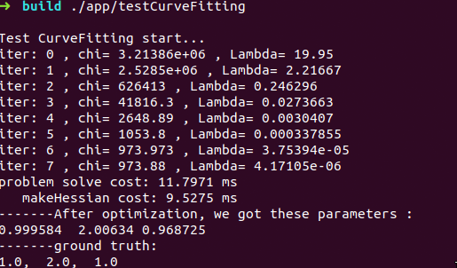

比之前多了更多的迭代次数，考虑方式1只修改$\lambda$，未对步长处理，所以优化效果较慢

### 2公式推导

$f_{15},g_{12}$如下

| 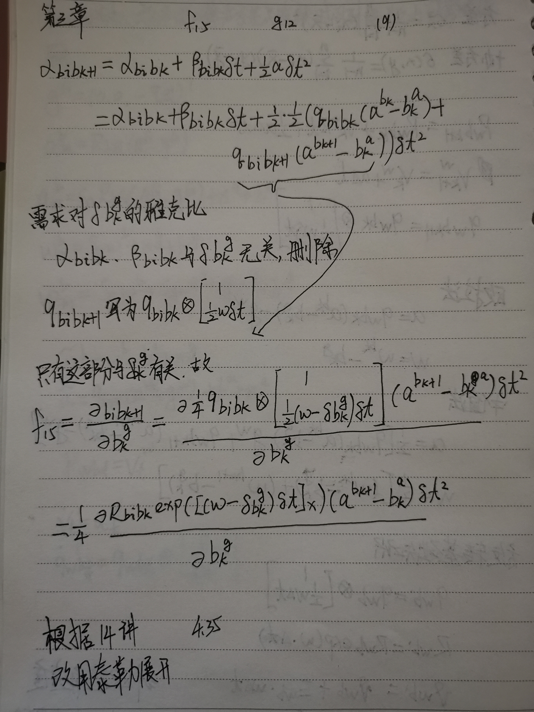 | 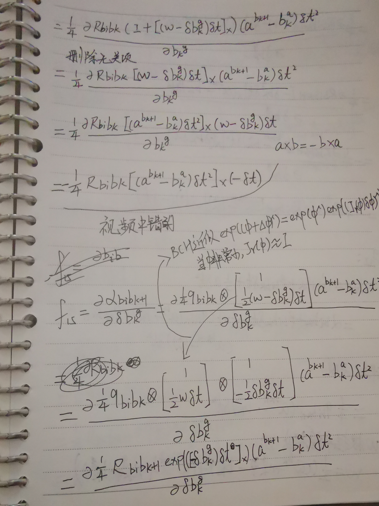 |
| ----------------------------------------- | ----------------------------------------- |
| 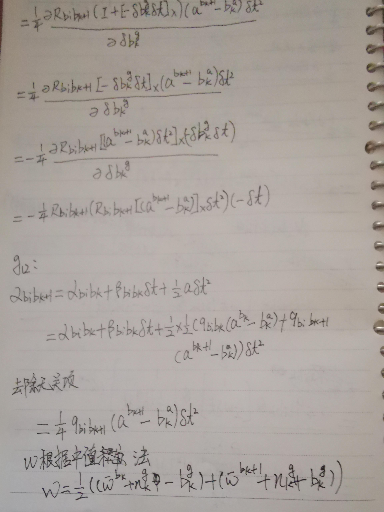 | 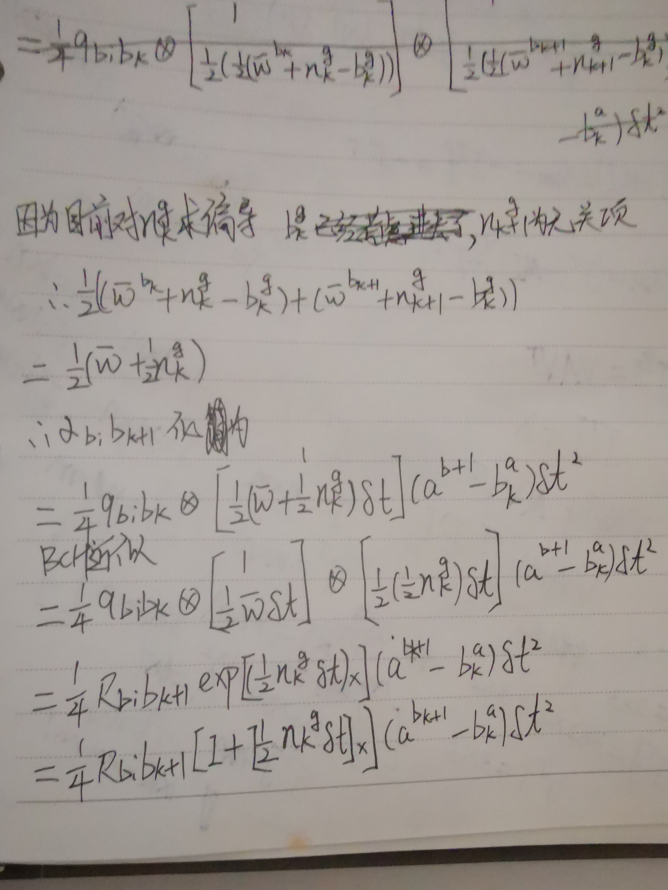 |
| 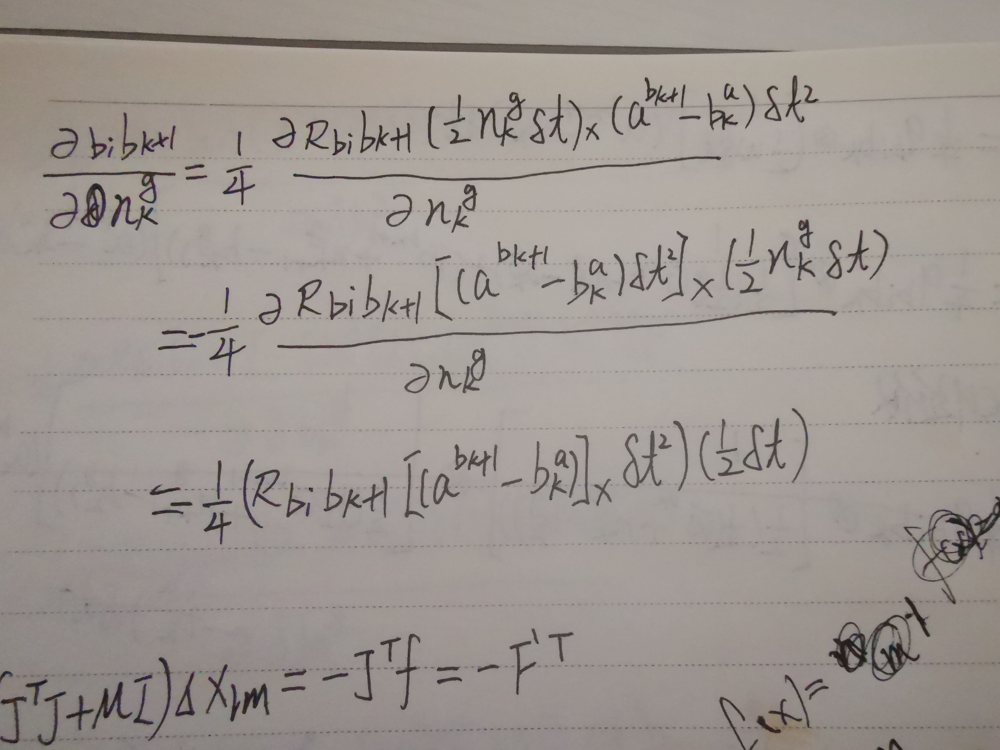 |                                           |

以上用ppt中的方法，但扰动更简单些，不用分析那么多参数

### 3证明（9）


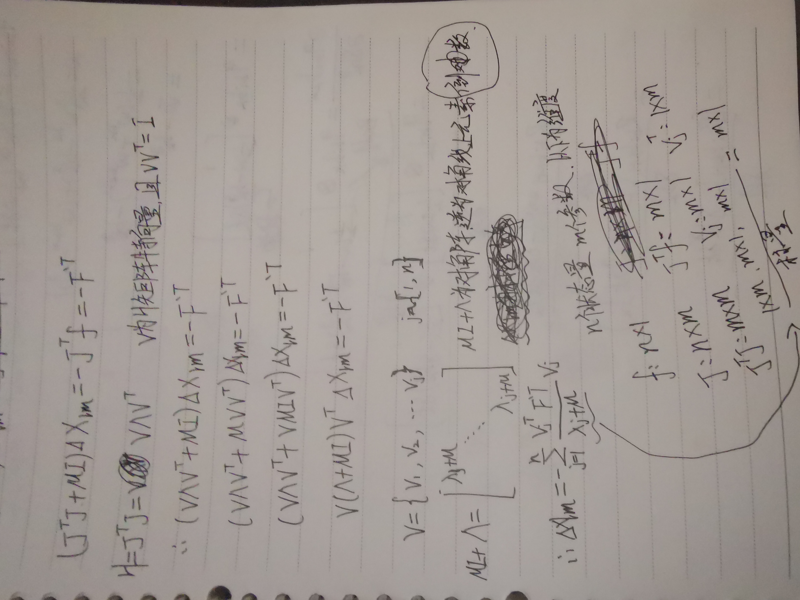


