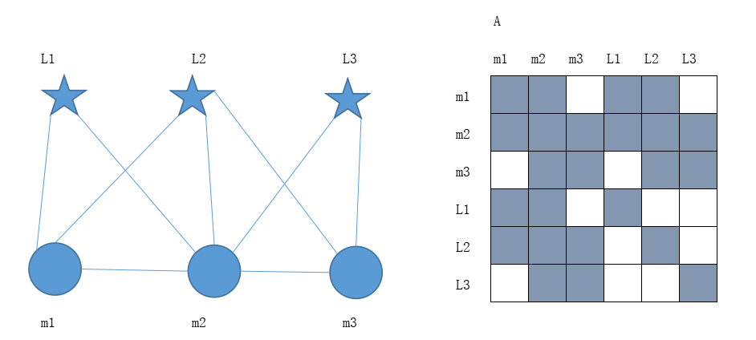
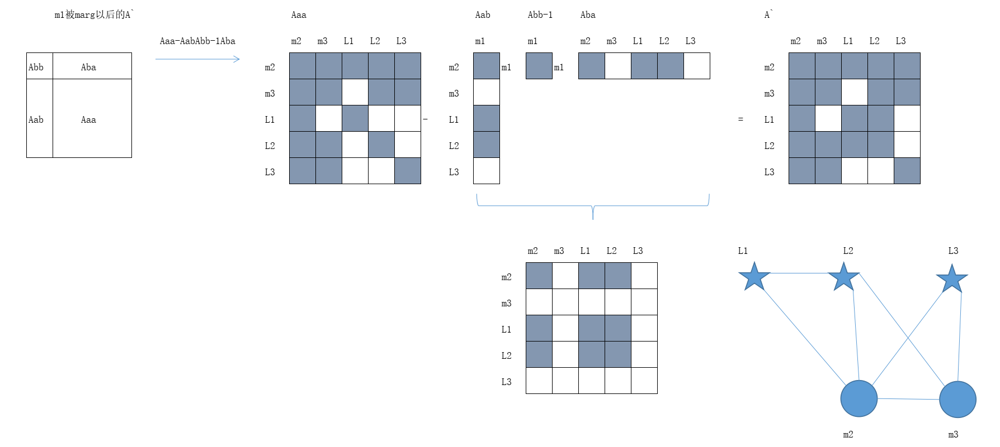
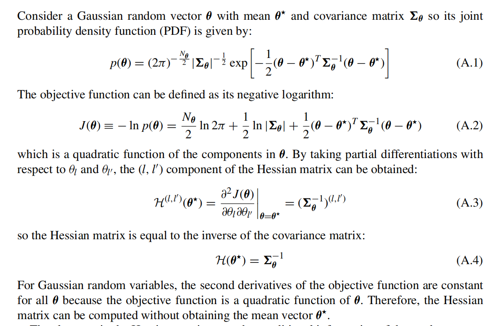
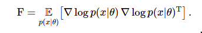
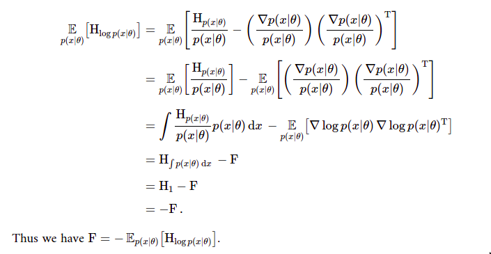
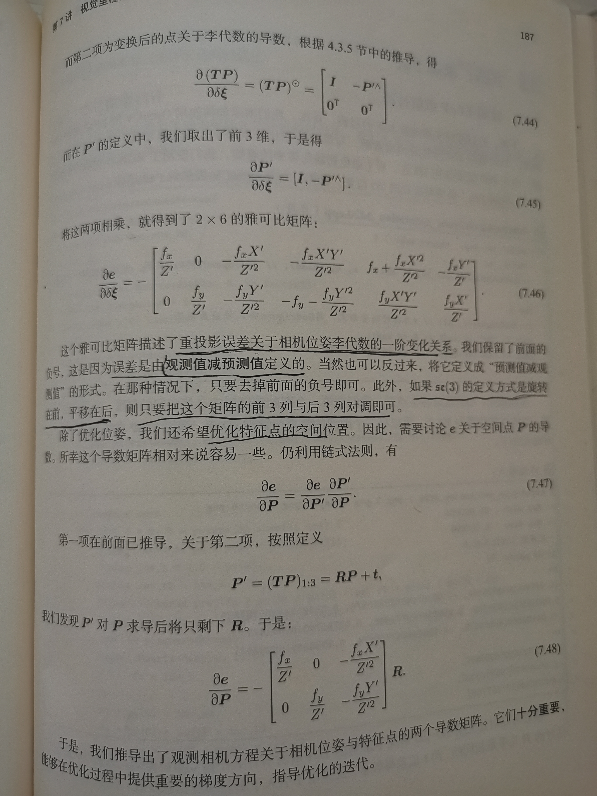
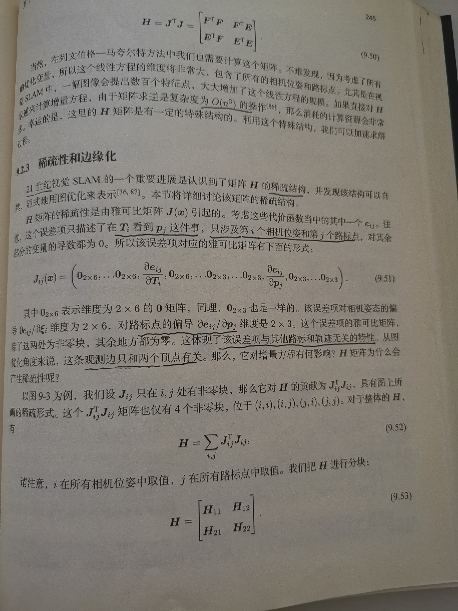
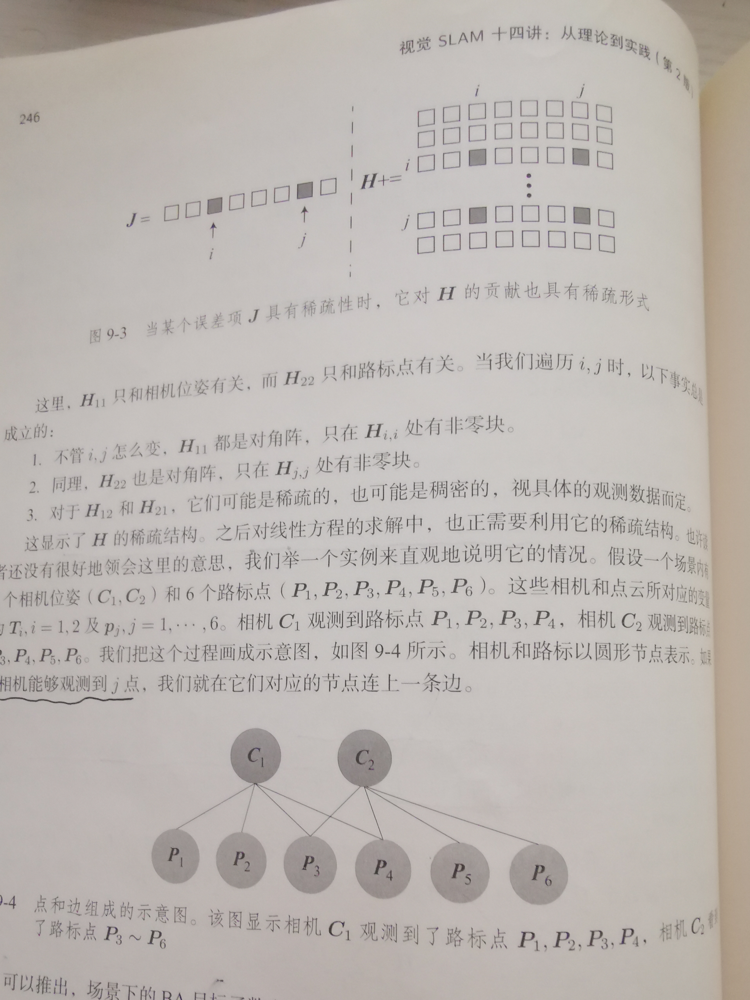
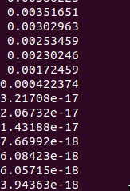

### 第四章

[TOC]

### 1 绘制信息矩阵

#### 1.1 绘制信息矩阵$\Lambda$



#### 1.2 绘制相机$\xi_1$被marg以后的$\Lambda^`$



### 2 证明信息矩阵和协方差矩阵的逆之前关系



参考这篇文字[Fisher Information Matrix](https://agustinus.kristia.de/techblog/2018/03/11/fisher-information/)

information 定义如下





在实际应用中，通常Hessian矩阵表示Information矩阵。原因是对某个时刻，其似然概率密度函数是一个单位脉冲函数，整个自变量取值范围内仅仅只有一个地方概率为1，其余为0，所以Hessian矩阵期望退化为Hessian.出自[这里](https://www.zhihu.com/question/388238460)。

### 3 作业补充，奇异值最后7位接近0

看到作业中fx,在14讲中理解jacobian_Pj，jacobian_Ti含义，如下



分别对用公式7.48 和 7.46。其中7.46因为旋转在前，平移在后，需要将前3列和后3列对调。

接下来是组装H矩阵

|  |  |
| ----------------------------------------- | ----------------------------------------- |

修改代码如下

```c++
H.block(i * 6, i * 6, 6, 6) += jacobian_Ti.transpose() * jacobian_Ti;
/// 请补充完整作业信息矩阵块的计算
// H.block(?,?,?,?) += ?;
// H.block(?,?,?,?) += ?;
// H.block(?,?,?,?) += ?;
H.block(i * 6, poseNums * 6 + j * 3, 6, 3) += jacobian_Ti.transpose() * jacobian_Pj;
H.block(poseNums * 6 + j * 3, i * 6, 3, 6) += jacobian_Pj.transpose() * jacobian_Ti;
H.block(poseNums * 6 + j * 3, poseNums * 6 + j * 3, 3, 3) += jacobian_Pj.transpose() * jacobian_Pj;
```

编译，执行，结果如下



最后7维接近于0，零空间的维度为7