### 第五章

[TOC]


### 1完成求解器

#### 1.1 完成H计算

```c++
auto v_i = verticies[i];
if (v_i->IsFixed()) continue; // Hessian 里不需要添加它的信息，也就是它的雅克比为 0

auto jacobian_i = jacobians[i];
ulong index_i = v_i->OrderingId();
ulong dim_i = v_i->LocalDimension();

MatXX JtW = jacobian_i.transpose() * edge.second->Information();
for (size_t j = i; j < verticies.size(); ++j) {
auto v_j = verticies[j];

if (v_j->IsFixed()) continue;

auto jacobian_j = jacobians[j];
ulong index_j = v_j->OrderingId();
ulong dim_j = v_j->LocalDimension();

assert(v_j->OrderingId() != -1);
MatXX hessian = JtW * jacobian_j;

// if (i == 0) {
// std::cout << "-----" << std::endl;
// std::cout << "i:" << i << ",j:" << j << ",dim:" << dim_i << "x" << dim_j << ",index_i:" << index_i << ",index_j:" << index_j << std::endl;
// std::cout << "-----" << std::endl;
// std::cout << "jacobian_i" << std::endl;
// std::cout << jacobian_i << std::endl;
// std::cout << "jacobian_j" << std::endl;
// std::cout << jacobian_j << std::endl;
// std::cout << "hessian" << std::endl;
// std::cout << hessian << std::endl;
// }
// 所有的信息矩阵叠加起来
// TODO:: home work. 完成 H index 的填写.
// H.block(?,?, ?, ?).noalias() += hessian;
H.block(index_i, index_j, dim_i, dim_j).noalias() += hessian;
if (j != i) {
// 对称的下三角
// TODO:: home work. 完成 H index 的填写.
// H.block(?,?, ?, ?).noalias() += hessian.transpose();
H.block(index_j, index_i, dim_j, dim_i).noalias() += hessian;
}
```

经过代码分析及log，在代码中完成下三角矩阵，在if判断里，完成是上三角矩阵。

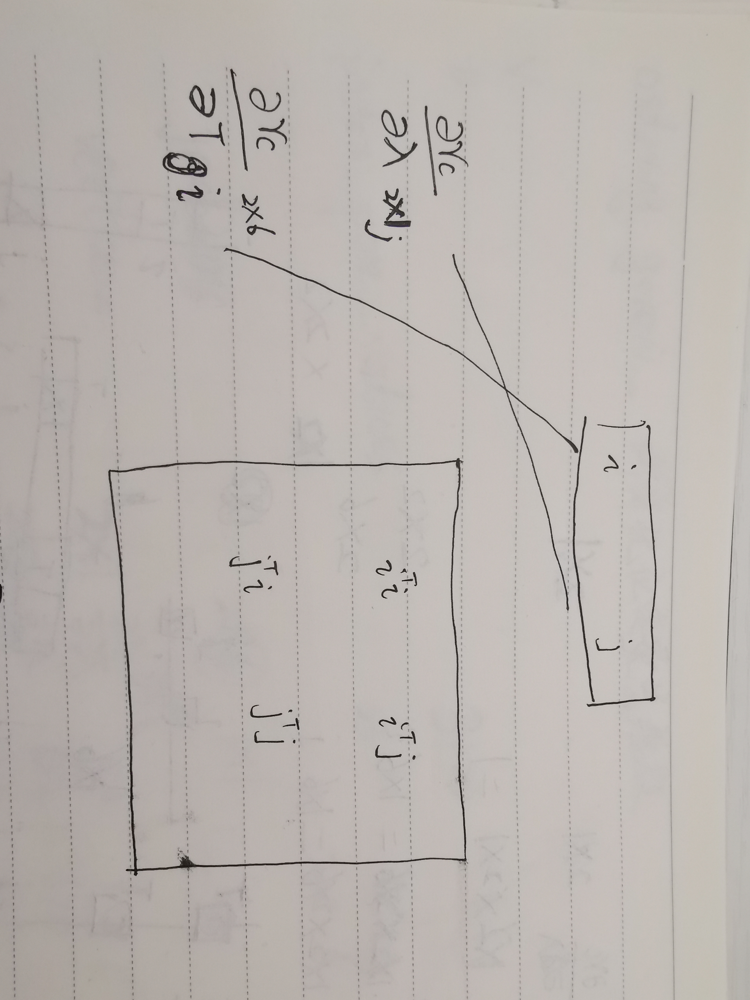

如图所示，逆深度对应j的位置，所以导致整个H矩阵从矩阵下右开始初始化，先初始化了下三角。

#### 1.2 完成SolveLinearSystem代码

```c++
// SLAM 问题采用舒尔补的计算方式
// step1: schur marginalization --> Hpp, bpp
int reserve_size = ordering_poses_;
int marg_size = ordering_landmarks_;

// TODO:: home work. 完成矩阵块取值，Hmm，Hpm，Hmp，bpp，bmm
// MatXX Hmm = Hessian_.block(?,?, ?, ?);
// MatXX Hpm = Hessian_.block(?,?, ?, ?);
// MatXX Hmp = Hessian_.block(?,?, ?, ?);
// VecX bpp = b_.segment(?,?);
// VecX bmm = b_.segment(?,?);

MatXX Hmm = Hessian_.block(ordering_poses_, ordering_poses_, ordering_landmarks_, ordering_landmarks_);
MatXX Hpm = Hessian_.block(0, ordering_poses_, ordering_poses_, ordering_landmarks_);
MatXX Hmp = Hessian_.block(ordering_poses_, 0, ordering_landmarks_, ordering_poses_);
VecX bpp = b_.segment(0, ordering_poses_);
VecX bmm = b_.segment(ordering_poses_, ordering_landmarks_);

// Hmm 是对角线矩阵，它的求逆可以直接为对角线块分别求逆，如果是逆深度，对角线块为1维的，则直接为对角线的倒数，这里可以加速
MatXX Hmm_inv(MatXX::Zero(marg_size, marg_size));
for (auto landmarkVertex : idx_landmark_vertices_) {
int idx = landmarkVertex.second->OrderingId() - reserve_size;
int size = landmarkVertex.second->LocalDimension();
Hmm_inv.block(idx, idx, size, size) = Hmm.block(idx, idx, size, size).inverse();
}

// TODO:: home work. 完成舒尔补 Hpp, bpp 代码
MatXX tempH = Hpm * Hmm_inv;
// H_pp_schur_ = Hessian_.block(?,?,?,?) - tempH * Hmp;
// b_pp_schur_ = bpp - ? * ?;
H_pp_schur_ = Hessian_.block(0, 0, ordering_poses_, ordering_poses_) - tempH * Hmp;
b_pp_schur_ = bpp - tempH * bmm;

// step2: solve Hpp * delta_x = bpp
VecX delta_x_pp(VecX::Zero(reserve_size));
// PCG Solver
for (ulong i = 0; i < ordering_poses_; ++i) {
H_pp_schur_(i, i) += currentLambda_;
}

int n = H_pp_schur_.rows() * 2;                      // 迭代次数
delta_x_pp = PCGSolver(H_pp_schur_, b_pp_schur_, n); // 哈哈，小规模问题，搞 pcg 花里胡哨
delta_x_.head(reserve_size) = delta_x_pp;
//        std::cout << delta_x_pp.transpose() << std::endl;

// TODO:: home work. step3: solve landmark
VecX delta_x_ll(marg_size);
// delta_x_ll = ???;
delta_x_ll = Hmm_inv * (bmm - Hpm.transpose() * delta_x_pp);
delta_x_.tail(marg_size) = delta_x_ll;
```

代码给的比较完善，对舒尔补比较了解的话，比较容易。

#### 1.3 编译

按照readme进行编译，结果如下

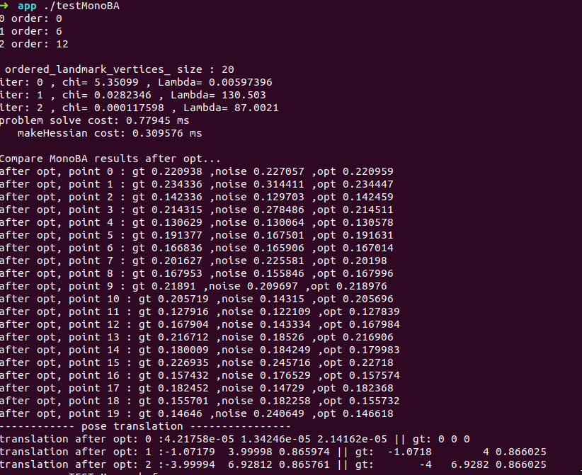

可以看到第一个pose与初始pose偏离较多。将第一个pose固定

```c++
if (i < 2)
	vertexCam->SetFixed();
```

也可以看到在H矩阵中，将fix的雅克比矩阵设置为0。结果如下

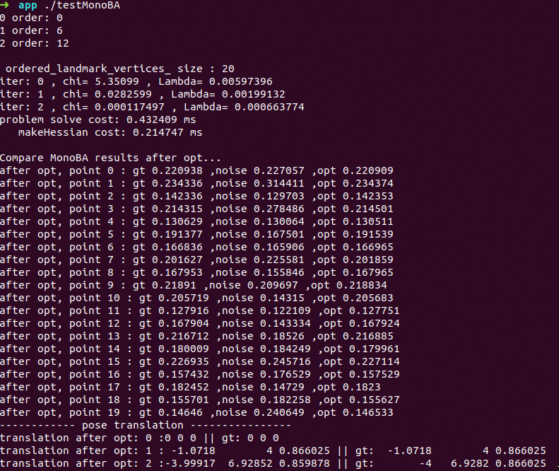

第一个pose与初始pose没有偏离

### 2 完成滑动窗口

```c++
// Add marg test
int idx = 1;          // marg 中间那个变量
int dim = 1;          // marg 变量的维度
int reserve_size = 3; // 总共变量的维度
double delta1 = 0.1 * 0.1;
double delta2 = 0.2 * 0.2;
double delta3 = 0.3 * 0.3;

int cols = 3;
MatXX H_marg(MatXX::Zero(cols, cols));
H_marg << 1. / delta1, -1. / delta1, 0,
-1. / delta1, 1. / delta1 + 1. / delta2 + 1. / delta3, -1. / delta3,
0., -1. / delta3, 1 / delta3;
std::cout << "---------- TEST Marg: before marg------------" << std::endl;
std::cout << H_marg << std::endl;

// TODO:: home work. 将变量移动到右下角
/// 准备工作： move the marg pose to the Hmm bottown right
// 将 row i 移动矩阵最下面
Eigen::MatrixXd temp_rows = H_marg.block(idx, 0, dim, reserve_size);
Eigen::MatrixXd temp_botRows = H_marg.block(idx + dim, 0, reserve_size - idx - dim, reserve_size);
// H_marg.block(?,?,?,?) = temp_botRows;
// H_marg.block(?,?,?,?) = temp_rows;
H_marg.block(idx, 0, reserve_size - idx - dim, reserve_size) = temp_botRows;
H_marg.block(reserve_size - dim, 0, dim, reserve_size) = temp_rows;

// 将 col i 移动矩阵最右边
Eigen::MatrixXd temp_cols = H_marg.block(0, idx, reserve_size, dim);
Eigen::MatrixXd temp_rightCols = H_marg.block(0, idx + dim, reserve_size, reserve_size - idx - dim);
H_marg.block(0, idx, reserve_size, reserve_size - idx - dim) = temp_rightCols;
H_marg.block(0, reserve_size - dim, reserve_size, dim) = temp_cols;

std::cout << "---------- TEST Marg: 将变量移动到右下角------------" << std::endl;
std::cout << H_marg << std::endl;

/// 开始 marg ： schur
double eps = 1e-8;
int m2 = dim;
int n2 = reserve_size - dim; // 剩余变量的维度
Eigen::MatrixXd Amm = 0.5 * (H_marg.block(n2, n2, m2, m2) + H_marg.block(n2, n2, m2, m2).transpose());

Eigen::SelfAdjointEigenSolver<Eigen::MatrixXd> saes(Amm);
Eigen::MatrixXd Amm_inv = saes.eigenvectors() * Eigen::VectorXd((saes.eigenvalues().array() > eps).select(saes.eigenvalues().array().inverse(), 0)).asDiagonal() *
saes.eigenvectors().transpose();

// TODO:: home work. 完成舒尔补操作
//Eigen::MatrixXd Arm = H_marg.block(?,?,?,?);
//Eigen::MatrixXd Amr = H_marg.block(?,?,?,?);
//Eigen::MatrixXd Arr = H_marg.block(?,?,?,?);

Eigen::MatrixXd Arm = H_marg.block(0, n2, n2, m2);
Eigen::MatrixXd Amr = H_marg.block(n2, 0, m2, n2);
Eigen::MatrixXd Arr = H_marg.block(0, 0, n2, n2);

Eigen::MatrixXd tempB = Arm * Amm_inv;
Eigen::MatrixXd H_prior = Arr - tempB * Amr;

std::cout << "---------- TEST Marg: after marg------------" << std::endl;
std::cout << H_prior << std::endl;
```

这里需要注意是b在初始化H矩阵时候已经加了负号

```c++
b.segment(index_i, dim_i).noalias() -= JtW * edge.second->Residual();
```

故按照公式计算不需要负号

结果如下

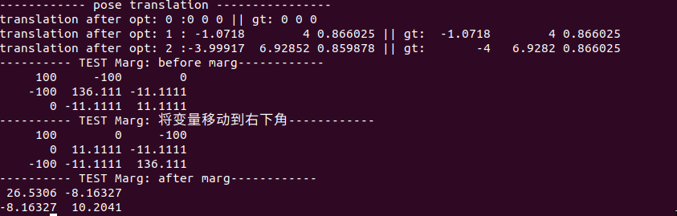

将中间位置及相关块移到右下角。代码中先将2，3行对角，再将2，3列对调。接下来进行舒尔补按ppt执行就行了

### 3 论文阅读

非线性优化最小二乘问题描述为视觉观测和imu观测

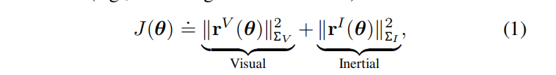

对于公式1，不变参数表示为

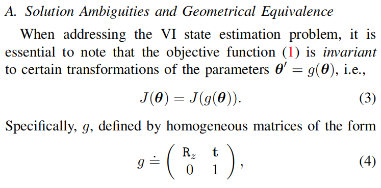

g是齐次方程。t为平移，R为绕z轴旋转,4自由度

重新表示g函数

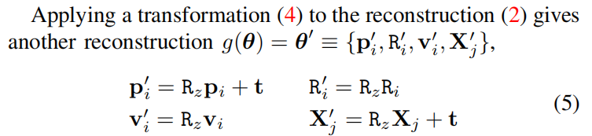

最小化目标函数，使用高斯牛顿法带来了一些困难。H矩阵的维度如表

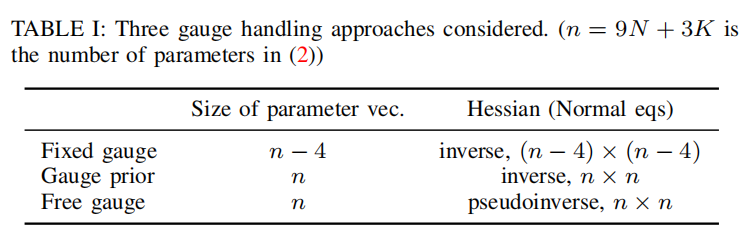

gauge fixation approach:在一个更小的参数空间中进行优化，没有不可观测的状态，因此H是可逆的矩阵。本质上是对解决方案施加了严格的约束

gauge prior approach：用一个额外的惩罚（产生一个可逆的H）来增加目标函数，以支持该解满足一定的约束，以一种软的方式

free gauge approach:使用奇异H的伪逆来隐式地为唯一解提供额外的约束（具有最小范数的参数更新）

尺度固定和尺度先验对旋转参数

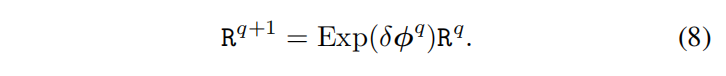

这里使用的右乘。

相对于R0使用更省事的方法定义

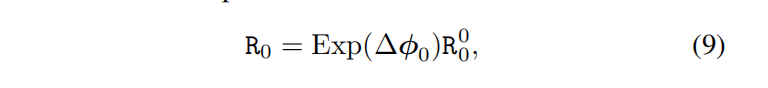

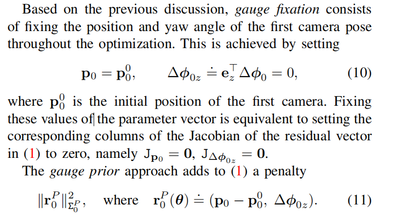

固定向量某些参数的值相当于设置对应的雅可比为0

free gauge approach 方法使参数在迭代中自由演化

实验中使用3个6自由度的轨迹，即一个正弦状的形状，一个弧形的和一个矩形的。如图所示

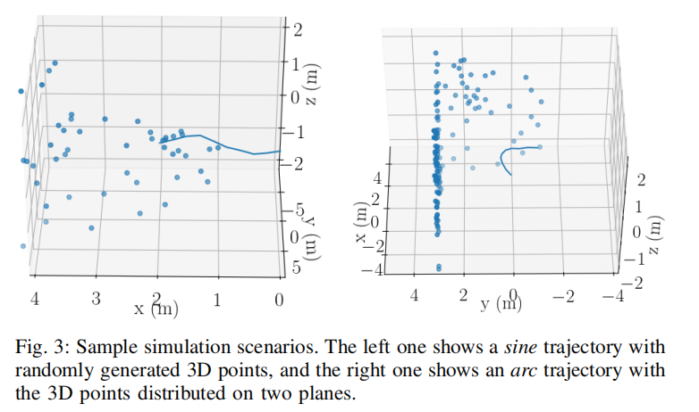

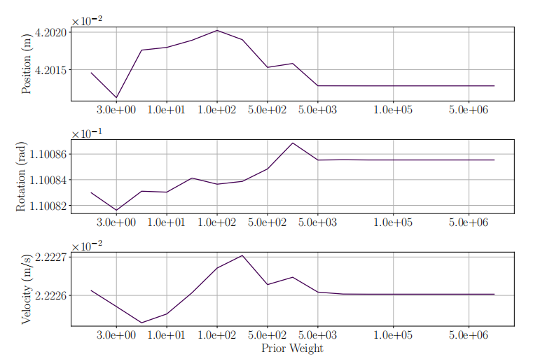

不同的先验估计的RMSE误差相似，对于不同预估参数，没有最优的先验值，但先验超过一定量级后趋于稳定。

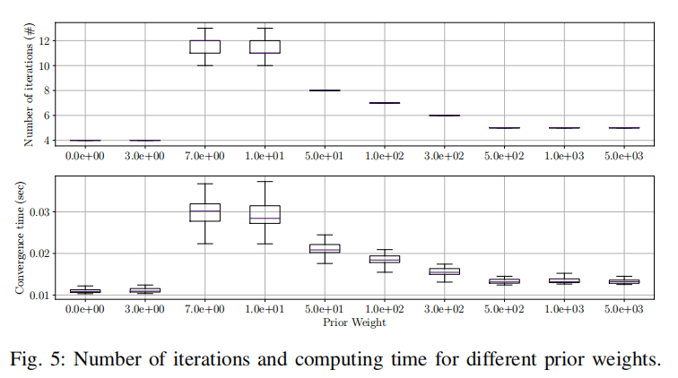

与图4相似，迭代次数和收敛时间大于某值趋于稳定。一个有趣现象，当先验从0到阈值中间，计算时间出现了峰值。

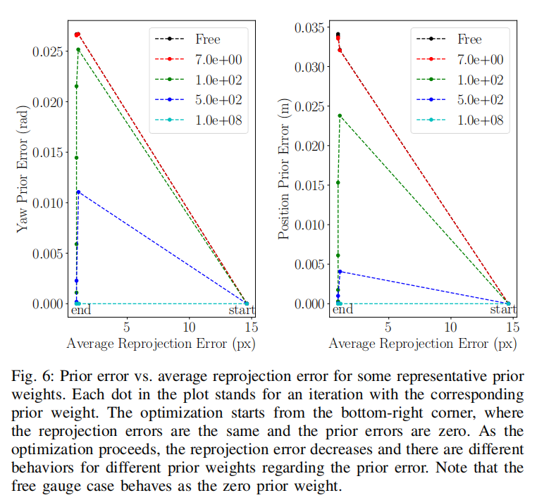

对于非常大的先验权重(10e8),算法减少重投影误差几乎等于0.对于较小的先验权重（如50-500），优化算法以增加先验误差为代价，减少了前两次迭代中的重投影误差。优化算法花费多次迭代次数来微调先验误差，同时保持较小的重投影误差（沿轨道移动），从而增加了计算时间。

总结：对于不同的先验权重，解的精度没有显著变化。在gaugeprior approach中，需要正确地选择先验权重，以保持计算成本较小。极大的权重被丢弃，因为它们有时会使优化不稳定。在本节的其余部分中，我们使用适当的先验权重（例如，10e5）来进行测量先验方法

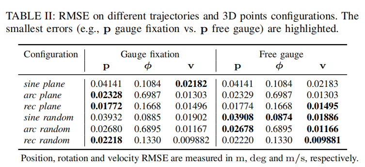

表二列出了50次试验的RMSE。 省略了gauge prior approach方法因为与 guage fix差不多。可以看出free gauge approach 和 gauge fixation approach 有微小的不同。

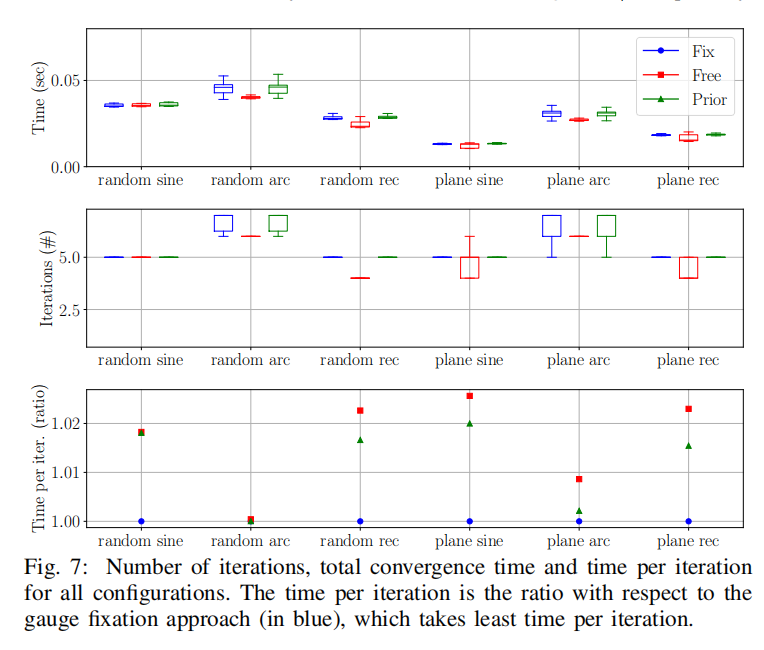

收敛时间和迭代次数如图7.prior approach 和 gauge fixation approach计算成本几乎相同，free gauge approach稍微快点。

总结:

1)这三种方法具有几乎相同的准确性

2)在 gauge prior approach中，需要选择适当的先验权值，以避免增加计算成本

3)在适当的权重下，gauge prior approach具有与gauge fixation approach几乎相同的性能（精度和计算成本）

4)free gauge approach比其他方法稍微快一些，因为它需要更少的迭代来收敛

### 4 给第一帧和第二帧添加prior约束

添加prior约束相当于添加新的测量。请教贺博部分记录下：

```tex
6dof的一个轨迹先验约束（比如视觉地图重定位提供一个pose的约束），根据代码可以自己推导误差以及雅可比。
假设你有一个6dof的gps作为 pose的约束,就可以构建这个prior,比如视觉的重定位地图
代码的状态参数应该是平移在前，旋转在后
```

edge_prior总结如下

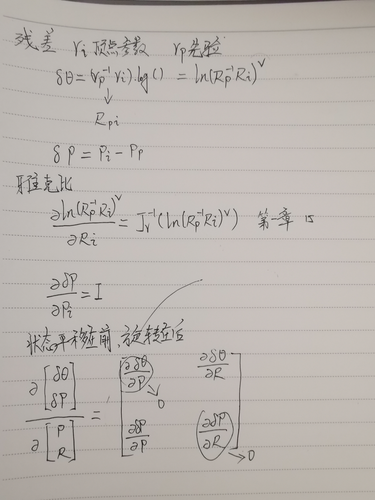

代码如下

```c++
double weight = 0;
for (size_t i = 0; i < 2; i++) {
shared_ptr<EdgeSE3Prior> edge_prior(new EdgeSE3Prior(cameras[i].twc, cameras[i].qwc));
std::vector<std::shared_ptr<Vertex>> edge_prior_vertex;
edge_prior_vertex.push_back(vertexCams_vec[i]);
edge_prior->SetVertex(edge_prior_vertex);
edge_prior->SetInformation(edge_prior->Information() * weight);
problem.AddEdge(edge_prior);
}
```

接下来就是weight取不同值进行比对。结果细节见附件，精度比较接近，对比迭代次数和耗时

| weight   | 0           | 1e3         | 1e5        | 1e7         | 1e9         |
| -------- | ----------- | ----------- | ---------- | ----------- | ----------- |
| 耗时     | 0.570621 ms | 0.875183 ms | 3.78076 ms | 0.370537 ms | 0.676508 ms |
| 迭代次数 | 3           | 5           | 5          | 3           | 3           |

迭代次数随着weight增加先增大，再减小；耗时也是随着weight增大先增大，后减小。

### 附件

weight:0

0 order: 0
1 order: 6
2 order: 12

 ordered_landmark_vertices_ size : 20
iter: 0 , chi= 5.35099 , Lambda= 0.00597396
iter: 1 , chi= 0.0282346 , Lambda= 130.503
iter: 2 , chi= 0.000117598 , Lambda= 87.0021
problem solve cost: 0.570621 ms
   makeHessian cost: 0.225482 ms

Compare MonoBA results after opt...
after opt, point 0 : gt 0.220938 ,noise 0.227057 ,opt 0.220959
after opt, point 1 : gt 0.234336 ,noise 0.314411 ,opt 0.234447
after opt, point 2 : gt 0.142336 ,noise 0.129703 ,opt 0.142459
after opt, point 3 : gt 0.214315 ,noise 0.278486 ,opt 0.214511
after opt, point 4 : gt 0.130629 ,noise 0.130064 ,opt 0.130578
after opt, point 5 : gt 0.191377 ,noise 0.167501 ,opt 0.191631
after opt, point 6 : gt 0.166836 ,noise 0.165906 ,opt 0.167014
after opt, point 7 : gt 0.201627 ,noise 0.225581 ,opt 0.20198
after opt, point 8 : gt 0.167953 ,noise 0.155846 ,opt 0.167996
after opt, point 9 : gt 0.21891 ,noise 0.209697 ,opt 0.218976
after opt, point 10 : gt 0.205719 ,noise 0.14315 ,opt 0.205696
after opt, point 11 : gt 0.127916 ,noise 0.122109 ,opt 0.127839
after opt, point 12 : gt 0.167904 ,noise 0.143334 ,opt 0.167984
after opt, point 13 : gt 0.216712 ,noise 0.18526 ,opt 0.216906
after opt, point 14 : gt 0.180009 ,noise 0.184249 ,opt 0.179983
after opt, point 15 : gt 0.226935 ,noise 0.245716 ,opt 0.22718
after opt, point 16 : gt 0.157432 ,noise 0.176529 ,opt 0.157574
after opt, point 17 : gt 0.182452 ,noise 0.14729 ,opt 0.182368
after opt, point 18 : gt 0.155701 ,noise 0.182258 ,opt 0.155732
after opt, point 19 : gt 0.14646 ,noise 0.240649 ,opt 0.146618
------------ pose translation ----------------
translation after opt: 0 :4.21758e-05 1.34246e-05 2.14162e-05 || gt: 0 0 0
translation after opt: 1 :-1.07179  3.99998 0.865974 || gt:  -1.0718        4 0.866025
translation after opt: 2 :-3.99994  6.92812 0.865761 || gt:       -4   6.9282 0.866025

weight:1e3

0 order: 0
1 order: 6
2 order: 12

 ordered_landmark_vertices_ size : 20
iter: 0 , chi= 5.35099 , Lambda= 0.0115702
iter: 1 , chi= 0.0291045 , Lambda= 0.00385675
iter: 2 , chi= 0.000133031 , Lambda= 0.0822773
iter: 3 , chi= 0.000125958 , Lambda= 0.0548515
iter: 4 , chi= 0.000124881 , Lambda= 0.0365677
problem solve cost: 0.875183 ms
   makeHessian cost: 0.476902 ms

Compare MonoBA results after opt...
after opt, point 0 : gt 0.220938 ,noise 0.227057 ,opt 0.220968
after opt, point 1 : gt 0.234336 ,noise 0.314411 ,opt 0.234401
after opt, point 2 : gt 0.142336 ,noise 0.129703 ,opt 0.142369
after opt, point 3 : gt 0.214315 ,noise 0.278486 ,opt 0.214543
after opt, point 4 : gt 0.130629 ,noise 0.130064 ,opt 0.130527
after opt, point 5 : gt 0.191377 ,noise 0.167501 ,opt 0.191584
after opt, point 6 : gt 0.166836 ,noise 0.165906 ,opt 0.16701
after opt, point 7 : gt 0.201627 ,noise 0.225581 ,opt 0.201895
after opt, point 8 : gt 0.167953 ,noise 0.155846 ,opt 0.168003
after opt, point 9 : gt 0.21891 ,noise 0.209697 ,opt 0.218882
after opt, point 10 : gt 0.205719 ,noise 0.14315 ,opt 0.20574
after opt, point 11 : gt 0.127916 ,noise 0.122109 ,opt 0.127761
after opt, point 12 : gt 0.167904 ,noise 0.143334 ,opt 0.167966
after opt, point 13 : gt 0.216712 ,noise 0.18526 ,opt 0.216947
after opt, point 14 : gt 0.180009 ,noise 0.184249 ,opt 0.180008
after opt, point 15 : gt 0.226935 ,noise 0.245716 ,opt 0.227188
after opt, point 16 : gt 0.157432 ,noise 0.176529 ,opt 0.157561
after opt, point 17 : gt 0.182452 ,noise 0.14729 ,opt 0.182337
after opt, point 18 : gt 0.155701 ,noise 0.182258 ,opt 0.15564
after opt, point 19 : gt 0.14646 ,noise 0.240649 ,opt 0.146478
------------ pose translation ----------------
translation after opt: 0 :-5.99839e-07 -3.52597e-07  1.55047e-06 || gt: 0 0 0
translation after opt: 1 : -1.0718        4 0.866024 || gt:  -1.0718        4 0.866025
translation after opt: 2 :-3.99954  6.92563 0.856618 || gt:       -4   6.9282 0.866025

weight:1e5

0 order: 0
1 order: 6
2 order: 12

 ordered_landmark_vertices_ size : 20
iter: 0 , chi= 5.35099 , Lambda= 1.00157
iter: 1 , chi= 0.0281118 , Lambda= 0.333857
iter: 2 , chi= 0.000118183 , Lambda= 0.111286
iter: 3 , chi= 0.000116074 , Lambda= 0.0741904
iter: 4 , chi= 0.000115755 , Lambda= 0.0494603
problem solve cost: 3.78076 ms
   makeHessian cost: 2.38807 ms

Compare MonoBA results after opt...
after opt, point 0 : gt 0.220938 ,noise 0.227057 ,opt 0.220896
after opt, point 1 : gt 0.234336 ,noise 0.314411 ,opt 0.234333
after opt, point 2 : gt 0.142336 ,noise 0.129703 ,opt 0.142373
after opt, point 3 : gt 0.214315 ,noise 0.278486 ,opt 0.214473
after opt, point 4 : gt 0.130629 ,noise 0.130064 ,opt 0.130518
after opt, point 5 : gt 0.191377 ,noise 0.167501 ,opt 0.191552
after opt, point 6 : gt 0.166836 ,noise 0.165906 ,opt 0.166975
after opt, point 7 : gt 0.201627 ,noise 0.225581 ,opt 0.201868
after opt, point 8 : gt 0.167953 ,noise 0.155846 ,opt 0.167967
after opt, point 9 : gt 0.21891 ,noise 0.209697 ,opt 0.218856
after opt, point 10 : gt 0.205719 ,noise 0.14315 ,opt 0.205667
after opt, point 11 : gt 0.127916 ,noise 0.122109 ,opt 0.127762
after opt, point 12 : gt 0.167904 ,noise 0.143334 ,opt 0.167935
after opt, point 13 : gt 0.216712 ,noise 0.18526 ,opt 0.216869
after opt, point 14 : gt 0.180009 ,noise 0.184249 ,opt 0.17996
after opt, point 15 : gt 0.226935 ,noise 0.245716 ,opt 0.227121
after opt, point 16 : gt 0.157432 ,noise 0.176529 ,opt 0.157531
after opt, point 17 : gt 0.182452 ,noise 0.14729 ,opt 0.182298
after opt, point 18 : gt 0.155701 ,noise 0.182258 ,opt 0.155632
after opt, point 19 : gt 0.14646 ,noise 0.240649 ,opt 0.146468
------------ pose translation ----------------
translation after opt: 0 :-1.23616e-08  -5.3496e-09  1.62968e-08 || gt: 0 0 0
translation after opt: 1 : -1.0718        4 0.866025 || gt:  -1.0718        4 0.866025
translation after opt: 2 :-4.00094  6.92742 0.861664 || gt:       -4   6.9282 0.866025

weight:1e7

0 order: 0
1 order: 6
2 order: 12

 ordered_landmark_vertices_ size : 20
iter: 0 , chi= 5.35099 , Lambda= 100.002
iter: 1 , chi= 0.0281271 , Lambda= 66.6677
iter: 2 , chi= 0.000121156 , Lambda= 44.4451
problem solve cost: 0.370537 ms
   makeHessian cost: 0.224644 ms

Compare MonoBA results after opt...
after opt, point 0 : gt 0.220938 ,noise 0.227057 ,opt 0.220952
after opt, point 1 : gt 0.234336 ,noise 0.314411 ,opt 0.234296
after opt, point 2 : gt 0.142336 ,noise 0.129703 ,opt 0.142391
after opt, point 3 : gt 0.214315 ,noise 0.278486 ,opt 0.214502
after opt, point 4 : gt 0.130629 ,noise 0.130064 ,opt 0.130574
after opt, point 5 : gt 0.191377 ,noise 0.167501 ,opt 0.191541
after opt, point 6 : gt 0.166836 ,noise 0.165906 ,opt 0.166941
after opt, point 7 : gt 0.201627 ,noise 0.225581 ,opt 0.201915
after opt, point 8 : gt 0.167953 ,noise 0.155846 ,opt 0.167979
after opt, point 9 : gt 0.21891 ,noise 0.209697 ,opt 0.218853
after opt, point 10 : gt 0.205719 ,noise 0.14315 ,opt 0.205597
after opt, point 11 : gt 0.127916 ,noise 0.122109 ,opt 0.127814
after opt, point 12 : gt 0.167904 ,noise 0.143334 ,opt 0.167906
after opt, point 13 : gt 0.216712 ,noise 0.18526 ,opt 0.216915
after opt, point 14 : gt 0.180009 ,noise 0.184249 ,opt 0.179961
after opt, point 15 : gt 0.226935 ,noise 0.245716 ,opt 0.227071
after opt, point 16 : gt 0.157432 ,noise 0.176529 ,opt 0.157563
after opt, point 17 : gt 0.182452 ,noise 0.14729 ,opt 0.182343
after opt, point 18 : gt 0.155701 ,noise 0.182258 ,opt 0.15572
after opt, point 19 : gt 0.14646 ,noise 0.240649 ,opt 0.146567
------------ pose translation ----------------
translation after opt: 0 :2.33179e-11 3.15796e-11 5.60613e-11 || gt: 0 0 0
translation after opt: 1 : -1.0718        4 0.866025 || gt:  -1.0718        4 0.866025
translation after opt: 2 :-4.00001   6.9282 0.866031 || gt:       -4   6.9282 0.866025

weight:1e9

0 order: 0
1 order: 6
2 order: 12

 ordered_landmark_vertices_ size : 20
iter: 0 , chi= 5.35099 , Lambda= 10000
iter: 1 , chi= 0.028125 , Lambda= 6666.67
iter: 2 , chi= 0.000121314 , Lambda= 4444.45
problem solve cost: 0.676508 ms
   makeHessian cost: 0.389024 ms

Compare MonoBA results after opt...
after opt, point 0 : gt 0.220938 ,noise 0.227057 ,opt 0.220953
after opt, point 1 : gt 0.234336 ,noise 0.314411 ,opt 0.234289
after opt, point 2 : gt 0.142336 ,noise 0.129703 ,opt 0.142387
after opt, point 3 : gt 0.214315 ,noise 0.278486 ,opt 0.214503
after opt, point 4 : gt 0.130629 ,noise 0.130064 ,opt 0.130576
after opt, point 5 : gt 0.191377 ,noise 0.167501 ,opt 0.191537
after opt, point 6 : gt 0.166836 ,noise 0.165906 ,opt 0.166937
after opt, point 7 : gt 0.201627 ,noise 0.225581 ,opt 0.201913
after opt, point 8 : gt 0.167953 ,noise 0.155846 ,opt 0.167979
after opt, point 9 : gt 0.21891 ,noise 0.209697 ,opt 0.218848
after opt, point 10 : gt 0.205719 ,noise 0.14315 ,opt 0.205592
after opt, point 11 : gt 0.127916 ,noise 0.122109 ,opt 0.127814
after opt, point 12 : gt 0.167904 ,noise 0.143334 ,opt 0.167902
after opt, point 13 : gt 0.216712 ,noise 0.18526 ,opt 0.216918
after opt, point 14 : gt 0.180009 ,noise 0.184249 ,opt 0.179961
after opt, point 15 : gt 0.226935 ,noise 0.245716 ,opt 0.227066
after opt, point 16 : gt 0.157432 ,noise 0.176529 ,opt 0.157563
after opt, point 17 : gt 0.182452 ,noise 0.14729 ,opt 0.182343
after opt, point 18 : gt 0.155701 ,noise 0.182258 ,opt 0.155721
after opt, point 19 : gt 0.14646 ,noise 0.240649 ,opt 0.146565
------------ pose translation ----------------
translation after opt: 0 :7.97848e-15 1.21035e-14 1.14416e-14 || gt: 0 0 0
translation after opt: 1 : -1.0718        4 0.866025 || gt:  -1.0718        4 0.866025
translation after opt: 2 :      -4   6.9282 0.866025 || gt:       -4   6.9282 0.866025