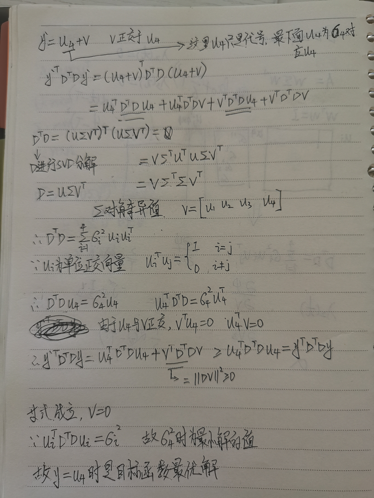
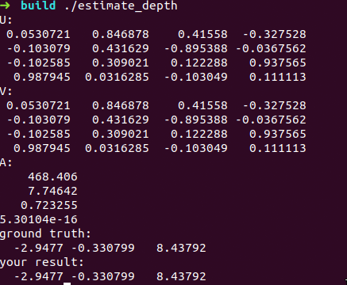
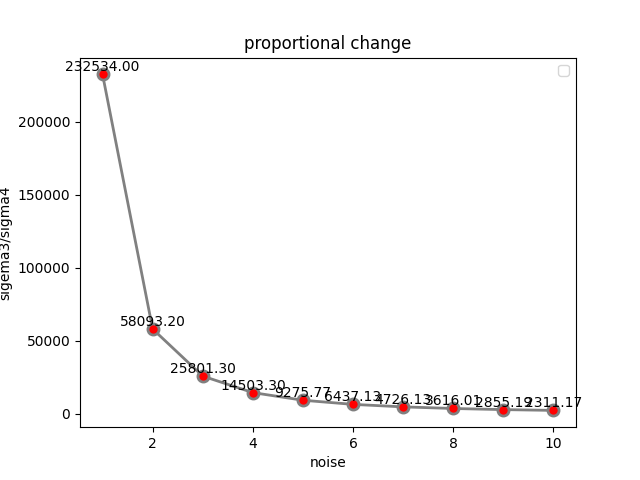
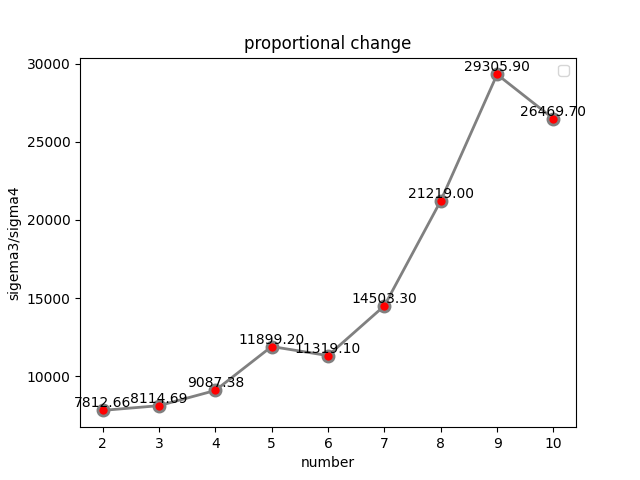

### 第六章

[TOC]


### 1 证明式（15）



### 2 完成三角化代码

代码如下

```c++
Eigen::MatrixXd D(2 * (end_frame_id - start_frame_id), 4);
D.setZero();
Eigen::Matrix<double, 1, 4> pk1;
pk1.setZero();
Eigen::Matrix<double, 1, 4> pk2;
pk2.setZero();
Eigen::Matrix<double, 1, 4> pk3;
pk3.setZero();
for (int i = start_frame_id; i < end_frame_id; i++) {
//R^T
Eigen::Matrix3d Rcw = camera_pose[i].Rwc.transpose();
//-R^T*t
Eigen::Vector3d tcw = -Rcw * camera_pose[i].twc;
pk1 << Rcw.block<1, 3>(0, 0), tcw(0);
pk2 << Rcw.block<1, 3>(1, 0), tcw(1);
pk3 << Rcw.block<1, 3>(2, 0), tcw(2);

D.block<1, 4>(2 * (i - start_frame_id), 0) = camera_pose[i].uv(0) * pk3 - pk1;
D.block<1, 4>(2 * (i - start_frame_id) + 1, 0) = camera_pose[i].uv(1) * pk3 - pk2;
}
Eigen::Matrix<double, 4, 4> DTD = D.transpose() * D;
Eigen::JacobiSVD<Eigen::MatrixXd> svd(DTD, Eigen::ComputeThinU | Eigen::ComputeThinV);
Eigen::MatrixXd U = svd.matrixU();
Eigen::MatrixXd V = svd.matrixU();
Eigen::Vector4d A = svd.singularValues();
std::cout << "U:\n"
    << U << std::endl;
std::cout << "V:\n"
    << V << std::endl;
std::cout << "A:\n"
    << A << std::endl;
P_est = V.block<3, 1>(0, 3) / U(3, 3); //齐次坐标归一化
```

注意P_est的结果需要归一化

结果如下



可以看到DTD是方阵，故U和V相同。奇异值$\sigma4 << \sigma3$,故三角化有效。真实和三角化结果一致，因为无误差

### 3 添加不同噪声值

参考第五章添加观测噪声，代码如下

```c++
std::normal_distribution<double> noise(0., 1. / 1000.);
...
camera_pose[i].uv = Eigen::Vector2d(x / z + noise(generator), y / z + noise(generator));
```

结果如下



由图可见，随着噪声方差变大，$$\frac{\sigma3}{\sigma4}$$比值在不断减少，误差越来越大。从结果来看比率在10e4时，误差在小数点后2位，认为是可以接受的误差。数据见附件1

### 4 帧数变化

固定噪声方差为4. / 1000.，通过改变start_frame_id从8到0递减，对比不同帧数比例变化



由图可见，随着观测次数增加，$$\frac{\sigma3}{\sigma4}$$比值在逐渐增加，中间有起伏，误差越来越小。即固定噪声方差情况下，观测次数越多，误差越小。数据见附件2

### 附件1

| 噪声方差    | $$\frac{\sigma3}{\sigma4}$$ |
| ----------- | --------------------------- |
| 1. / 1000.  | 232534                      |
| 2. / 1000.  | 58093.2                     |
| 3. / 1000.  | 25801.3                     |
| 4. / 1000.  | 14503.3                     |
| 5. / 1000.  | 9275.77                     |
| 6. / 1000.  | 6437.13                     |
| 7. / 1000.  | 4726.13                     |
| 8. / 1000.  | 3616.01                     |
| 9. / 1000.  | 2855.19                     |
| 10. / 1000. | 2311.17                     |

### 附件2

| 帧数 | $$\frac{\sigma3}{\sigma4}$$ |
| ---- | --------------------------- |
| 2    | 7812.66                     |
| 3    | 8114.69                     |
| 4    | 9087.38                     |
| 5    | 11899.2                     |
| 6    | 11319.1                     |
| 7    | 14503.3                     |
| 8    | 21219                       |
| 9    | 29305.9                     |
| 10   | 26469.7                     |

