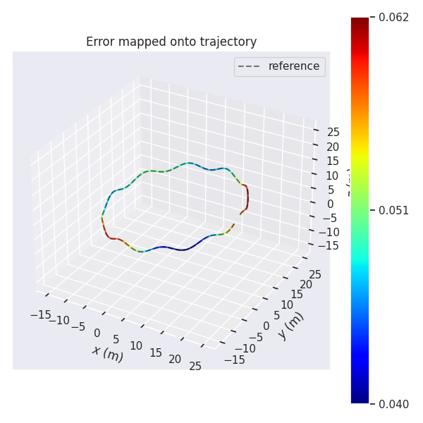
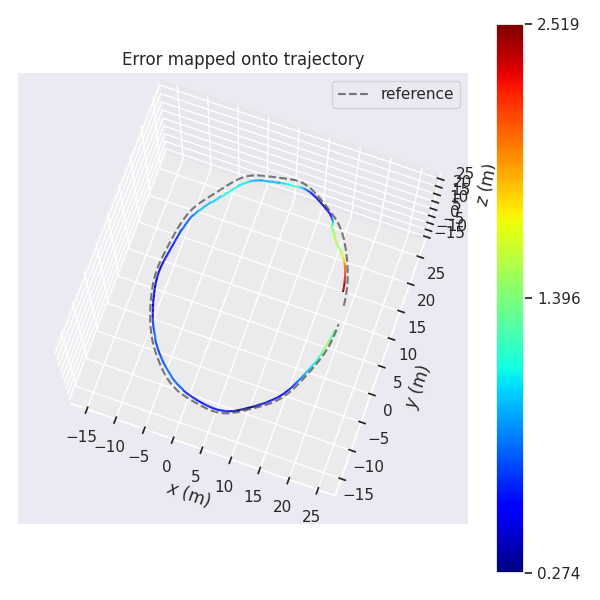
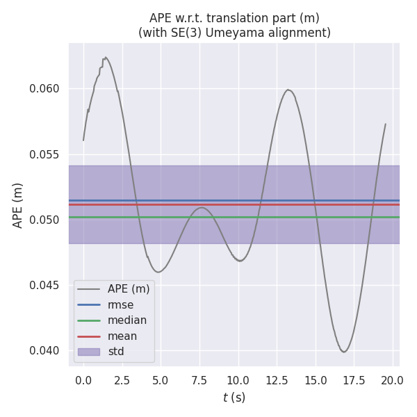
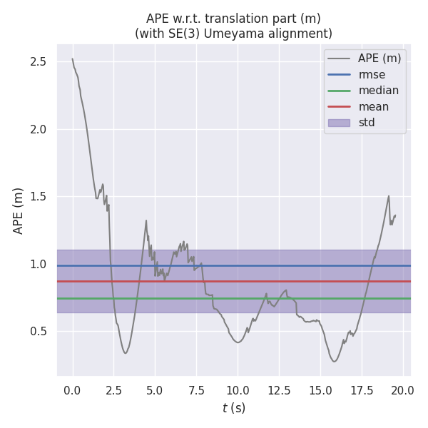
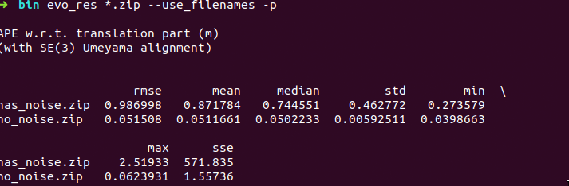
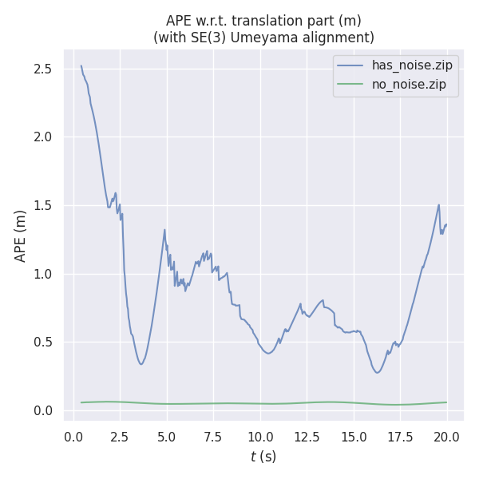
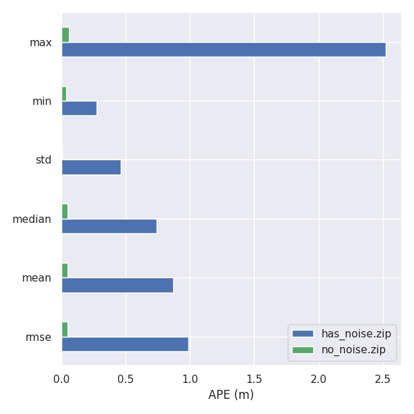
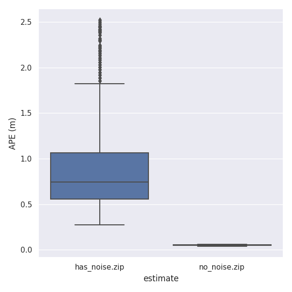

### 第七章

[TOC]


### 1代码修改

复制run_euroc 修改为run_simulation，修改PubImuData，主要修改vGyr和Vacc的提取方式

```c++
void PubImuData() {
    // string sImu_data_file = "../data/imu_pose_noise.txt";
    string sImu_data_file = "../data/imu_pose.txt";
    cout << "1 PubImuData start sImu_data_filea: " << sImu_data_file << endl;
    ifstream fsImu;
    fsImu.open(sImu_data_file.c_str());
    if (!fsImu.is_open()) {
        cerr << "Failed to open imu file! " << sImu_data_file << endl;
        return;
    }

    std::string sImu_line;
    double dStampNSec = 0.0;
    Eigen::Quaterniond q;
    Eigen::Vector3d t;
    Vector3d vAcc;
    Vector3d vGyr;
    while (std::getline(fsImu, sImu_line) && !sImu_line.empty()) // read imu data
    {
        std::istringstream ssImuData(sImu_line);
        ssImuData >> dStampNSec >>
            q.w() >> q.x() >> q.y() >> q.z() >>
            t(0) >> t(1) >> t(2) >>
            vGyr.x() >> vGyr.y() >> vGyr.z() >>
            vAcc.x() >> vAcc.y() >> vAcc.z();
        // cout << "Imu t: " << fixed << dStampNSec << " gyr: " << vGyr.transpose() << " acc: " << vAcc.transpose() << endl;
        pSystem->PubImuData(dStampNSec, vGyr, vAcc);
        usleep(5000 * nDelayTimes);
    }
    fsImu.close();
}
```

修改PubImageData，主要修改特征点的提取方式

```c++
void PubImageData() {
    string sImage_file = "../data/cam_pose.txt";

    cout << "1 PubImageData start sImage_file: " << sImage_file << endl;

    ifstream fsImage;
    fsImage.open(sImage_file.c_str());
    if (!fsImage.is_open()) {
        cerr << "Failed to open image file! " << sImage_file << endl;
        return;
    }

    std::string sImage_line;
    double dStampNSec;
    string sImgFileName;
    int n = 0;

    // cv::namedWindow("SOURCE IMAGE", CV_WINDOW_AUTOSIZE);
    while (std::getline(fsImage, sImage_line) && !sImage_line.empty()) {
        std::istringstream ssImuData(sImage_line);
        ssImuData >> dStampNSec;
        // cout << "Image t : " << fixed << dStampNSec << " Name: " << sImgFileName << endl;
        string linesPath = "../data/keyframe/all_lines_" + std::to_string(n) + ".txt";

        ifstream fsLines;
        fsLines.open(linesPath.c_str());
        if (!fsLines.is_open()) {
            cerr << "Failed to open image file! " << linesPath << endl;
            return;
        }

        std::cout << "open keyframe:" << linesPath << std::endl;
        //产生前后2个特征点，根据house模型产生的(两个点产生的)，只取后一个
        Eigen::Vector2d point_uv1;
        Eigen::Vector2d point_uv2;
        std::vector<Eigen::Vector2d, Eigen::aligned_allocator<Eigen::Vector2d>> features;

        std::string sLine;

        while (std::getline(fsLines, sLine) && !sLine.empty()) {
            std::istringstream ssLineData(sLine);
            // std::cout << "sline:" << sLine << std::endl;
            ssLineData >> point_uv1(0) >> point_uv1(1) >> point_uv2(0) >> point_uv2(1);
            features.emplace_back(point_uv2);
        }

        fsLines.close();
        pSystem->PubFeatureData(dStampNSec, features);
        usleep(50000 * nDelayTimes);
        n++;
    }
    fsImage.close();
}
```

system中新建PubFeatureData方法，处理特征点

```c++
void System::PubFeatureData(double dStampSec,
                            std::vector<Eigen::Vector2d, Eigen::aligned_allocator<Eigen::Vector2d>> features) {
    if (!init_feature) {
        cout << "1 PubImageData skip the first detected feature, which doesn't contain optical flow speed" << endl;
        init_feature = 1;
        return;
    }

    if (first_image_flag) {
        cout << "2 PubImageData first_image_flag" << endl;
        first_image_flag = false;
        first_image_time = dStampSec;
        last_image_time = dStampSec;
        return;
    }
    // detect unstable camera stream
    if (dStampSec - last_image_time > 1.0 || dStampSec < last_image_time) {
        cerr << "3 PubImageData image discontinue! reset the feature tracker!" << endl;
        first_image_flag = true;
        last_image_time = 0;
        pub_count = 1;
        return;
    }
    last_image_time = dStampSec;

    PUB_THIS_FRAME = true;

    TicToc t_r;

    if (PUB_THIS_FRAME) {
        pub_count++;
        shared_ptr<IMG_MSG> feature_points(new IMG_MSG());
        feature_points->header = dStampSec;
        vector<set<int>> hash_ids(NUM_OF_CAM);
        for (int i = 0; i < NUM_OF_CAM; i++) {
            for (unsigned int j = 0; j < features.size(); j++) {
                int p_id = j;
                hash_ids[i].insert(p_id);
                double x = features[j].x();
                double y = features[j].y();
                double z = 1;
                feature_points->points.push_back(Vector3d(x, y, z));
                feature_points->id_of_point.push_back(p_id * NUM_OF_CAM + i);

                cv::Point2f pixels;
                pixels.x = 460 * x + 255;
                pixels.y = 460 * y + 255;
                feature_points->u_of_point.push_back(pixels.x);
                feature_points->v_of_point.push_back(pixels.y);
                feature_points->velocity_x_of_point.push_back(0);
                feature_points->velocity_y_of_point.push_back(0);
            }
            // skip the first image; since no optical speed on frist image
            if (!init_pub) {
                cout << "4 PubImage init_pub skip the first image!" << endl;
                init_pub = 1;
            } else {
                m_buf.lock();
                feature_buf.push(feature_points);
                // cout << "5 PubImage t : " << fixed << feature_points->header
                //     << " feature_buf size: " << feature_buf.size() << endl;
                m_buf.unlock();
                con.notify_one();
            }
        }
    }
}
```

程序输出pose_output.txt tum格式不符，做如下修改

```c++
ofs_pose << fixed << dStamp << " "
                         << p_wi(0) << " " << p_wi(1) << " " << p_wi(2) << " "
                         << q_wi.x() << " " << q_wi.y() << " " << q_wi.z() << " " << q_wi.w() << endl;
```

按照vio_data_simulation修改配置文件euroc_config.yaml

```yaml
image_width: 640
image_height: 640
distortion_parameters:
   k1: 0
   k2: 0
   p1: 0
   p2: 0
projection_parameters:
   fx: 460
   fy: 460
   cx: 255
   cy: 255

# Extrinsic parameter between IMU and Camera.
estimate_extrinsic: 0   # 0  Have an accurate extrinsic parameters. We will trust the following imu^R_cam, imu^T_cam, don't change it.
                        # 1  Have an initial guess about extrinsic parameters. We will optimize around your initial guess.
                        # 2  Don't know anything about extrinsic parameters. You don't need to give R,T. We will try to calibrate it. Do some rotation movement at beginning.                        
#If you choose 0 or 1, you should write down the following matrix.
#Rotation from camera frame to imu frame, imu^R_cam
extrinsicRotation: !!opencv-matrix
   rows: 3
   cols: 3
   dt: d
   data: [0, 0, -1,
         -1, 0, 0,
         0, 1, 0]
#Translation from camera frame to imu frame, imu^T_cam
extrinsicTranslation: !!opencv-matrix
   rows: 3
   cols: 1
   dt: d
   data: [0.05,0.04,0.03]
```

```c++
acc_n: 0.019          # accelerometer measurement noise standard deviation. #0.2   0.04
gyr_n: 0.015         # gyroscope measurement noise standard deviation.     #0.05  0.004
acc_w: 0.0001         # accelerometer bias random work noise standard deviation.  #0.02
gyr_w: 1.0e-5       # gyroscope bias random work noise standard deviation.     #4.0e-5
```

evo的对比方式

```bash
evo_ape tum cam_pose_tum.txt pose_output.txt  -a --plot --plot_mode xyz --save_results ./no_noise.zip
evo_ape tum cam_pose_tum.txt pose_output.txt  -a --plot --plot_mode xyz --save_results ./has_noise.zip
evo_res *.zip --use_filenames -p
```

执行命令

```bash
➜  bin ./run_simulation ../data/ ../config/ 
```

### 2 结果分析

- 无噪声PubImuData 加载 imu_pose.txt

- 有噪声PubImuData 加载imu_pose_noise.txt

  ```c++
  double gyro_bias_sigma = 1.0e-5;
  double acc_bias_sigma = 0.0001;
  
  double gyro_noise_sigma = 0.015;    // rad/s * 1/sqrt(hz)
  double acc_noise_sigma = 0.019;      //　m/(s^2) * 1/sqrt(hz)
  ```

  

结果比对

| no_noise           | has_noise          |
| ------------------ | ------------------ |
|  |  |
|  |  |

综合比对

|  |  |
| ------------------ | ------------------ |
|  |  |

从以上结果，当加入误差后，rmse,max,min都有数量级上差异，且轨迹也发生了较大偏移。即随着imu噪声增大，位姿的估计越来越差