### 第八章

[TOC]

### 1 基于逆深度推导特征匀速模型

在《Online_Temporal_Calibration_for_Monocular_Visual-Inertial_Systems》论文中，特征速度计算

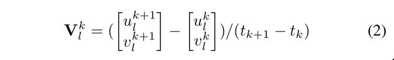

传统3D特征点残差计算

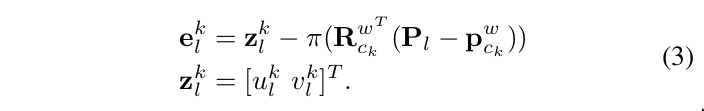

3D特征点考虑时间戳延迟的残差计算

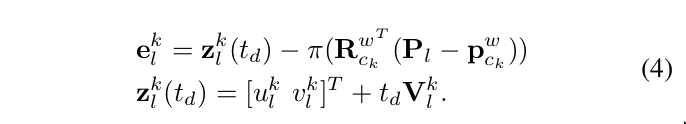

传统深度的参数计算

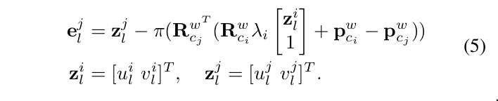

深度考虑时间戳延迟的残差计算

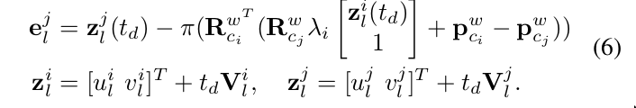

逆深度的传统残差计算

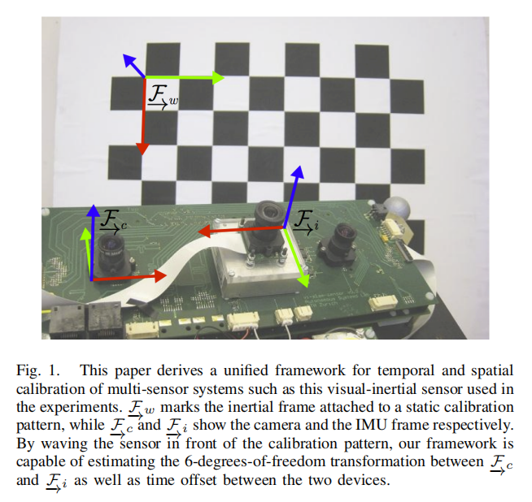

逆深度考虑时间时间延迟的残差计算，就是在传统残差计算上，加上

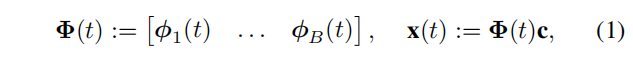

### 阅读论文

多传感器系统的统一时空校准
本文贡献：
1）我们提出了一种统一的方法来确定传感器之间的固定时间偏移，使用批量、连续时间、最大似然估计；
2）我们推导了一个用于相机和惯性测量单元(IMU)校准的估计器，它同时确定了相机和IMU之间的变换和时间偏移；
3）我们根据模拟和真实数据（从图1所示的设置）来评估估计器，并表明它足够敏感，可以确定最高速率传感器周期的一小部分的时间偏移，包括由于相机曝光时间造成的差异
4)我们证明了时延估计显著受益于加速测量中包含的额外信息——这些信息在以前的方法中没有被利用

III理论
A.使用基函数估计时间偏移量

时变状态公式 

估计时间偏差残差公式如下

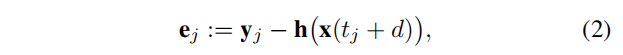

yj是时间tj的测量值，h是x的在tj的策略预测，d是时间偏移。

加上bias函数，定义如下

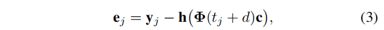

对误差非线性化转线性化，使用雅可比矩阵转换

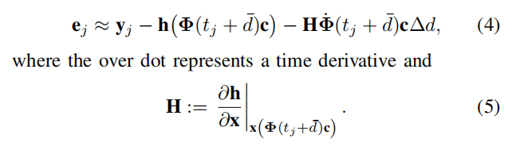

B.摄像头/IMU校准

标定目标是旋转矩阵，平移，时间偏差

为了标定，需要收集短时间的数据， T = [t1, tK] (typically 1–2 minutes),当传感器头在静态校准模式前摆动时.

描述估计参数，及使用B样条参数化时变状态

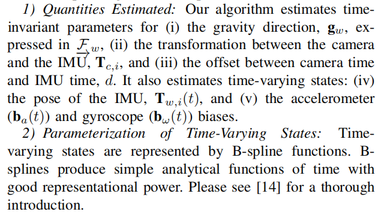

imu向世界坐标系转换

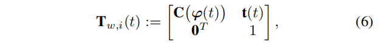

速度、加速度公式

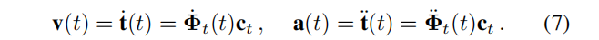

加速度公式

加速度，磁力计，tj + d is denoted ymj

imu的bias设置为零均值的高斯白噪声

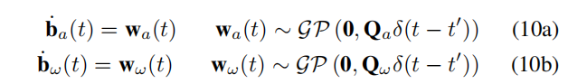

目标函数为

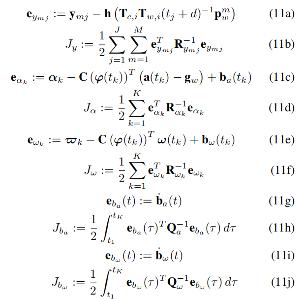

利用(LM)算法来最小化J：=Jy+Jα+Jω+Jba+Jbw，一次找到所有未知参数的最大似然估计。
